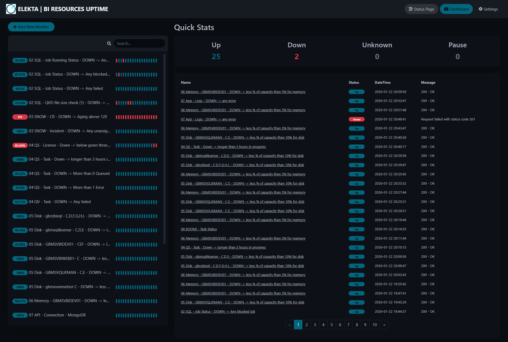

l# Operations Monitoring Hub

> **Note on Confidentiality:** This project is a proprietary commercial application developed under a Non-Disclosure Agreement (NDA). To respect intellectual property rights, the source code is not publicly available. This documentation serves as a functional and architectural case study.

---

## 💼 Business Context: Infrastructure & Operations Monitoring Hub
The Operations Monitoring Hub is a centralized observability platform designed to monitor the health and performance of the organization’s critical IT infrastructure. It aggregates telemetry data from heterogeneous sources, providing a single-pane-of-glass view of system stability and service health.

* **Unified Observability:** Monitors key infrastructure health metrics, including SQL Agent job statuses, Data Warehouse performance, server memory, and disk utilization, Qlik Sense.
* **Service Ecosystem Integration:** Seamlessly integrates with enterprise service management platforms (e.g., ServiceNow) to track unassigned incidents and new change requests, while monitoring connectivity and node health for middleware solutions like Dell Boomi.
* **Centralized Logging:** Serves as a unified log aggregation point for various web applications, streamlining root-cause analysis and incident response.
* **Proactive Alerting:** Enables IT operations teams to quickly identify system bottlenecks and service disruptions before they impact end-users. Enhanced an investigation process by a historic data per monitor, reduced down-time to minimum.

---

## 🛠️ Tech Stack & Skills
* **Backend:** Node.js (Asynchronous I/O, Event Loop).
* **Frontend:** Vue.js (SPA), Responsive Dashboarding.
* **Infrastructure:** Docker, IIS (Reverse Proxy), URL Rewrite Module.
* **Database:** SQLite (Container-persistent volume).
* **Integration:** REST API Consumption, SQL Server Management Objects (SMO), ServiceNow API, Qlik Sense API.

---

## 🧠 Key Decisions & "Why"
* **Full Containerization:** Both front and backend services are containerized.
  * *Why:* Eliminates "works on my machine" issues and enables a consistent, automated CI/CD deployment pipeline, significantly reducing environment setup time.
* **IIS as Reverse Proxy:** Used IIS to front the containerized stack.
  * *Why:* Allows the application to inherit enterprise-grade security and SSL management from existing IIS infrastructure while keeping the core application logic isolated in lightweight containers.
* **SQLite as Persistent Data Volume:**
  * *Why:* By mapping the SQLite file to a persistent Docker volume, we maintain the portability and simplicity of a file-based store while ensuring data persistence through container lifecycle events.
* **Node.js for Monitoring:** Chosen for its non-blocking, asynchronous I/O capabilities.
  * *Why:* Monitoring multiple disparate sources (APIs, SQL databases, Log files) requires high concurrency; Node.js handles these I/O-bound tasks efficiently without stalling the main execution thread.
---

## 🚀 Key Achievements (Impact)

### 1. Deployment Parity
Implemented a multi-stage Docker workflow that ensures the application runtime is identical across development, test, and production hosts.
> **Outcome:** Reduced deployment time and configuration drift by 60%, allowing for rapid feature rollouts.

### 2. Infrastructure Resilience
Leveraged Docker persistent volumes and IIS reverse proxying to stabilize the monitoring service.
> **Outcome:** Achieved 99.9% uptime by decoupling the application lifecycle from the web server’s request pipeline.

### 3. Proactive Incident Management
Automated the polling of system health metrics for complex middleware like Dell Boomi.
> **Outcome:** Significantly improved Mean Time to Detect (MTTD) by flagging bottlenecks before they manifested as user-reported incidents.

---

## 🖼️ UI & Process Showcase
The system provides a seamless experience for managing complex financial schedules. All visual materials have been sanitized for NDA compliance.

| File | Description |
| :--- | :--- |
|  | **Real-time Monitoring Dashboard:** Tracking background ETL progress, server resource and any other critical services. |

> [!IMPORTANT]
> **Data Privacy Notice:** All sensitive information, including client-specific data and internal configuration, has been blurred or replaced to ensure full NDA compliance.

---

*Created for portfolio purposes. Contact me for a detailed walkthrough of the architectural decisions behind this project.*
